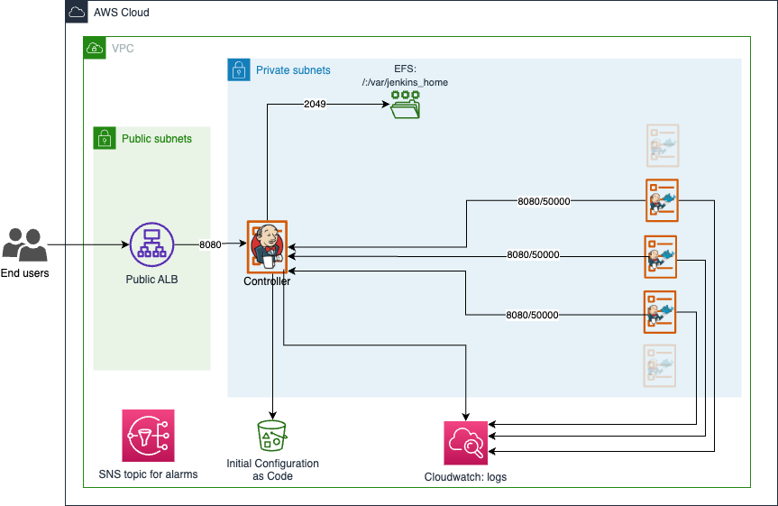

# Terraform Jenkins AWS ECS Fargate

Terraform stack to deploy Jenkins on ECS Fargate with Jenkins configuration stored in EFS and agents on Fargate. It can
be used as a starting point to build a production ready Jenkins on AWS.

More details can be found on [my blog post](https://blog.haidara.io/post/jenkins-aws-fargate/) (in French).

## How it works

It uses a docker image based on the [official Jenkins](https://github.com/jenkinsci/docker). See `docker/` folder.

The following main resources will be created:

- An application load balancer in front of Jenkins.
- A network load balancer for Agent -> Controller communication. For more information about how Controller <-> Agents
  communication works, see [this page](https://wiki.jenkins.io/display/JENKINS/Distributed+builds).
- An EFS to store Jenkins configuration.
- An S3 bucket used by the Jenkins Configuration as code plugin to get the configuration generated by Terraform.
- Two log groups for the Controller and agents logs



## Prerequisites

- A VPC with public and private subnets configured properly (route table, nat gateways...)
- An IAM user with the proper policies to run Terraform on the following services: EC2, ECS, IAM, S3, Cloudwatch, EFS,
  Route53 et ACM.
- A recent version of Terraform ( > 0.12.20)

The only required Terraform variables are:

- `vpc_id` : the VPC ID
- `public_subnets` : public subnets IDs
- `private_subnets` : private subnets IDs

See [variables.tf](./variables.tf) for all the possible variables to override.

AWS authentication:

```bash
export AWS_PROFILE=...
# or
export AWS_SECRET_ACCESS_KEY=""
export AWS_ACCESS_KEY_ID=""
```

Deployment:

```bash
export TF_VAR_vpc_id="vpc-123456789"
export TF_VAR_private_subnets='["private-subnet-a", "private-subnet-b", "private-subnet-c"]'
export TF_VAR_public_subnets='["public-subnet-a", "public--subnet-b", "public-subnet-c"]'
terraform init
terraform apply
```

Get the default admin credentials and connect to the controller url in the output `jenkins_public_url`:

```shell
terraform output jenkins_credentials
```

The first time you access the controller, the `Getting started` guide will ask you to install the recommended plugins.
Install them and restart the controller.

## Docs

<!-- BEGINNING OF PRE-COMMIT-TERRAFORM DOCS HOOK -->
### Requirements

| Name | Version |
|------|---------|
| <a name="requirement_terraform"></a> [terraform](#requirement\_terraform) | >= 1 |
| <a name="requirement_aws"></a> [aws](#requirement\_aws) | ~> 4 |
| <a name="requirement_random"></a> [random](#requirement\_random) | >= 3 |

### Providers

| Name | Version |
|------|---------|
| <a name="provider_aws"></a> [aws](#provider\_aws) | ~> 4 |
| <a name="provider_random"></a> [random](#provider\_random) | >= 3 |

### Modules

No modules.

### Resources

| Name | Type |
|------|------|
| [aws_acm_certificate.controller_certificate](https://registry.terraform.io/providers/hashicorp/aws/latest/docs/resources/acm_certificate) | resource |
| [aws_acm_certificate_validation.validation](https://registry.terraform.io/providers/hashicorp/aws/latest/docs/resources/acm_certificate_validation) | resource |
| [aws_alb.alb_jenkins_controller](https://registry.terraform.io/providers/hashicorp/aws/latest/docs/resources/alb) | resource |
| [aws_alb_target_group.jenkins_controller_tg](https://registry.terraform.io/providers/hashicorp/aws/latest/docs/resources/alb_target_group) | resource |
| [aws_cloudwatch_log_group.agents](https://registry.terraform.io/providers/hashicorp/aws/latest/docs/resources/cloudwatch_log_group) | resource |
| [aws_cloudwatch_log_group.jenkins_controller](https://registry.terraform.io/providers/hashicorp/aws/latest/docs/resources/cloudwatch_log_group) | resource |
| [aws_cloudwatch_metric_alarm.alb_healthy_host_count](https://registry.terraform.io/providers/hashicorp/aws/latest/docs/resources/cloudwatch_metric_alarm) | resource |
| [aws_cloudwatch_metric_alarm.alb_too_many_5xx_errors](https://registry.terraform.io/providers/hashicorp/aws/latest/docs/resources/cloudwatch_metric_alarm) | resource |
| [aws_cloudwatch_metric_alarm.efs_burst_credit_balance](https://registry.terraform.io/providers/hashicorp/aws/latest/docs/resources/cloudwatch_metric_alarm) | resource |
| [aws_cloudwatch_metric_alarm.jenkins_high_cpu](https://registry.terraform.io/providers/hashicorp/aws/latest/docs/resources/cloudwatch_metric_alarm) | resource |
| [aws_cloudwatch_metric_alarm.jenkins_high_memory](https://registry.terraform.io/providers/hashicorp/aws/latest/docs/resources/cloudwatch_metric_alarm) | resource |
| [aws_ecs_cluster.cluster](https://registry.terraform.io/providers/hashicorp/aws/latest/docs/resources/ecs_cluster) | resource |
| [aws_ecs_cluster_capacity_providers.capacity_providers](https://registry.terraform.io/providers/hashicorp/aws/latest/docs/resources/ecs_cluster_capacity_providers) | resource |
| [aws_ecs_service.jenkins_controller](https://registry.terraform.io/providers/hashicorp/aws/latest/docs/resources/ecs_service) | resource |
| [aws_ecs_task_definition.jenkins_controller](https://registry.terraform.io/providers/hashicorp/aws/latest/docs/resources/ecs_task_definition) | resource |
| [aws_efs_file_system.jenkins_conf](https://registry.terraform.io/providers/hashicorp/aws/latest/docs/resources/efs_file_system) | resource |
| [aws_efs_mount_target.mount_targets](https://registry.terraform.io/providers/hashicorp/aws/latest/docs/resources/efs_mount_target) | resource |
| [aws_iam_policy.controller_ecs_task](https://registry.terraform.io/providers/hashicorp/aws/latest/docs/resources/iam_policy) | resource |
| [aws_iam_role.agents_ecs_execution_role](https://registry.terraform.io/providers/hashicorp/aws/latest/docs/resources/iam_role) | resource |
| [aws_iam_role.agents_ecs_task_role](https://registry.terraform.io/providers/hashicorp/aws/latest/docs/resources/iam_role) | resource |
| [aws_iam_role.controller_ecs_execution_role](https://registry.terraform.io/providers/hashicorp/aws/latest/docs/resources/iam_role) | resource |
| [aws_iam_role.controller_ecs_task_role](https://registry.terraform.io/providers/hashicorp/aws/latest/docs/resources/iam_role) | resource |
| [aws_iam_role_policy_attachment.agents_execution_policy](https://registry.terraform.io/providers/hashicorp/aws/latest/docs/resources/iam_role_policy_attachment) | resource |
| [aws_iam_role_policy_attachment.controller_ecs_task](https://registry.terraform.io/providers/hashicorp/aws/latest/docs/resources/iam_role_policy_attachment) | resource |
| [aws_iam_role_policy_attachment.controller_execution_policy](https://registry.terraform.io/providers/hashicorp/aws/latest/docs/resources/iam_role_policy_attachment) | resource |
| [aws_lb.nlb_agents](https://registry.terraform.io/providers/hashicorp/aws/latest/docs/resources/lb) | resource |
| [aws_lb_listener.agents_http_listener](https://registry.terraform.io/providers/hashicorp/aws/latest/docs/resources/lb_listener) | resource |
| [aws_lb_listener.agents_jnlp_listener](https://registry.terraform.io/providers/hashicorp/aws/latest/docs/resources/lb_listener) | resource |
| [aws_lb_listener.controller_http](https://registry.terraform.io/providers/hashicorp/aws/latest/docs/resources/lb_listener) | resource |
| [aws_lb_listener.controller_http_redirect](https://registry.terraform.io/providers/hashicorp/aws/latest/docs/resources/lb_listener) | resource |
| [aws_lb_listener.controller_https](https://registry.terraform.io/providers/hashicorp/aws/latest/docs/resources/lb_listener) | resource |
| [aws_lb_target_group.nlb_agents_to_controller_http](https://registry.terraform.io/providers/hashicorp/aws/latest/docs/resources/lb_target_group) | resource |
| [aws_lb_target_group.nlb_agents_to_controller_jnlp](https://registry.terraform.io/providers/hashicorp/aws/latest/docs/resources/lb_target_group) | resource |
| [aws_route53_record.alb_dns_record](https://registry.terraform.io/providers/hashicorp/aws/latest/docs/resources/route53_record) | resource |
| [aws_route53_record.certificate_validation_record](https://registry.terraform.io/providers/hashicorp/aws/latest/docs/resources/route53_record) | resource |
| [aws_s3_bucket.jenkins_conf_bucket](https://registry.terraform.io/providers/hashicorp/aws/latest/docs/resources/s3_bucket) | resource |
| [aws_s3_bucket_acl.example](https://registry.terraform.io/providers/hashicorp/aws/latest/docs/resources/s3_bucket_acl) | resource |
| [aws_s3_bucket_versioning.conf_bucket](https://registry.terraform.io/providers/hashicorp/aws/latest/docs/resources/s3_bucket_versioning) | resource |
| [aws_s3_object.jenkins_conf](https://registry.terraform.io/providers/hashicorp/aws/latest/docs/resources/s3_object) | resource |
| [aws_security_group.alb_security_group](https://registry.terraform.io/providers/hashicorp/aws/latest/docs/resources/security_group) | resource |
| [aws_security_group.efs](https://registry.terraform.io/providers/hashicorp/aws/latest/docs/resources/security_group) | resource |
| [aws_security_group.jenkins_agents](https://registry.terraform.io/providers/hashicorp/aws/latest/docs/resources/security_group) | resource |
| [aws_security_group.jenkins_controller_ecs_service](https://registry.terraform.io/providers/hashicorp/aws/latest/docs/resources/security_group) | resource |
| [aws_security_group_rule.alb_egress_all](https://registry.terraform.io/providers/hashicorp/aws/latest/docs/resources/security_group_rule) | resource |
| [aws_security_group_rule.alb_ingress_http](https://registry.terraform.io/providers/hashicorp/aws/latest/docs/resources/security_group_rule) | resource |
| [aws_security_group_rule.alb_ingress_https](https://registry.terraform.io/providers/hashicorp/aws/latest/docs/resources/security_group_rule) | resource |
| [aws_security_group_rule.allow_agents_to_jks_jnlp_port](https://registry.terraform.io/providers/hashicorp/aws/latest/docs/resources/security_group_rule) | resource |
| [aws_security_group_rule.allow_jenkins_to_efs](https://registry.terraform.io/providers/hashicorp/aws/latest/docs/resources/security_group_rule) | resource |
| [aws_security_group_rule.controller_egress_all](https://registry.terraform.io/providers/hashicorp/aws/latest/docs/resources/security_group_rule) | resource |
| [aws_security_group_rule.from_private_nlb_network_interfaces](https://registry.terraform.io/providers/hashicorp/aws/latest/docs/resources/security_group_rule) | resource |
| [aws_security_group_rule.jenkins_agent_egress](https://registry.terraform.io/providers/hashicorp/aws/latest/docs/resources/security_group_rule) | resource |
| [aws_security_group_rule.jenkins_controller_ingress_alb](https://registry.terraform.io/providers/hashicorp/aws/latest/docs/resources/security_group_rule) | resource |
| [aws_sns_topic.alarms_topic](https://registry.terraform.io/providers/hashicorp/aws/latest/docs/resources/sns_topic) | resource |
| [random_password.admin_password](https://registry.terraform.io/providers/hashicorp/random/latest/docs/resources/password) | resource |
| [aws_caller_identity.caller](https://registry.terraform.io/providers/hashicorp/aws/latest/docs/data-sources/caller_identity) | data source |
| [aws_iam_policy_document.controller_ecs_task](https://registry.terraform.io/providers/hashicorp/aws/latest/docs/data-sources/iam_policy_document) | data source |
| [aws_iam_policy_document.ecs_assume_role_policy](https://registry.terraform.io/providers/hashicorp/aws/latest/docs/data-sources/iam_policy_document) | data source |
| [aws_network_interface.each_network_interface](https://registry.terraform.io/providers/hashicorp/aws/latest/docs/data-sources/network_interface) | data source |
| [aws_route53_zone.dns_zone](https://registry.terraform.io/providers/hashicorp/aws/latest/docs/data-sources/route53_zone) | data source |

### Inputs

| Name | Description | Type | Default | Required |
|------|-------------|------|---------|:--------:|
| <a name="input_private_subnets"></a> [private\_subnets](#input\_private\_subnets) | Private subnets to deploy Jenkins and the internal NLB | `set(string)` | n/a | yes |
| <a name="input_public_subnets"></a> [public\_subnets](#input\_public\_subnets) | Public subnets to deploy the load balancer | `set(string)` | n/a | yes |
| <a name="input_vpc_id"></a> [vpc\_id](#input\_vpc\_id) | The VPC id | `string` | n/a | yes |
| <a name="input_agent_docker_image"></a> [agent\_docker\_image](#input\_agent\_docker\_image) | Docker image to use for the example agent. See: https://hub.docker.com/r/jenkins/inbound-agent/ | `string` | `"elmhaidara/jenkins-alpine-agent-aws:latest-alpine"` | no |
| <a name="input_agents_cpu_memory"></a> [agents\_cpu\_memory](#input\_agents\_cpu\_memory) | CPU and memory for the agent example. Note that all combinations are not supported with Fargate. | <pre>object({<br>    memory = number<br>    cpu    = number<br>  })</pre> | <pre>{<br>  "cpu": 1024,<br>  "memory": 2048<br>}</pre> | no |
| <a name="input_agents_log_retention_days"></a> [agents\_log\_retention\_days](#input\_agents\_log\_retention\_days) | Retention days for Agents log group | `number` | `5` | no |
| <a name="input_allowed_ip_addresses"></a> [allowed\_ip\_addresses](#input\_allowed\_ip\_addresses) | List of allowed IP addresses to access the controller from the ALB | `set(string)` | <pre>[<br>  "0.0.0.0/0"<br>]</pre> | no |
| <a name="input_aws_region"></a> [aws\_region](#input\_aws\_region) | The AWS region in which deploy the resources | `string` | `"eu-west-1"` | no |
| <a name="input_controller_cpu_memory"></a> [controller\_cpu\_memory](#input\_controller\_cpu\_memory) | CPU and memory for Jenkins controller. Note that all combinations are not supported with Fargate. | <pre>object({<br>    memory = number<br>    cpu    = number<br>  })</pre> | <pre>{<br>  "cpu": 1024,<br>  "memory": 2048<br>}</pre> | no |
| <a name="input_controller_deployment_percentages"></a> [controller\_deployment\_percentages](#input\_controller\_deployment\_percentages) | The Min and Max percentages of Controller instance to keep when updating the service. See https://docs.aws.amazon.com/AmazonECS/latest/developerguide/update-service.html | <pre>object({<br>    min = number<br>    max = number<br>  })</pre> | <pre>{<br>  "max": 100,<br>  "min": 0<br>}</pre> | no |
| <a name="input_controller_docker_image"></a> [controller\_docker\_image](#input\_controller\_docker\_image) | Jenkins Controller docker image to use | `string` | `"elmhaidara/jenkins-aws-fargate:2.338"` | no |
| <a name="input_controller_docker_user_uid_gid"></a> [controller\_docker\_user\_uid\_gid](#input\_controller\_docker\_user\_uid\_gid) | Jenkins User/Group ID inside the container. One should consider using access point. | `number` | `0` | no |
| <a name="input_controller_java_opts"></a> [controller\_java\_opts](#input\_controller\_java\_opts) | JENKINS\_OPTS to pass to the controller | `string` | `""` | no |
| <a name="input_controller_jnlp_port"></a> [controller\_jnlp\_port](#input\_controller\_jnlp\_port) | JNLP port used by Jenkins agent to communicate with the controller | `number` | `50000` | no |
| <a name="input_controller_listening_port"></a> [controller\_listening\_port](#input\_controller\_listening\_port) | Jenkins container listening port | `number` | `8080` | no |
| <a name="input_controller_log_retention_days"></a> [controller\_log\_retention\_days](#input\_controller\_log\_retention\_days) | Retention days for Controller log group | `number` | `14` | no |
| <a name="input_controller_num_executors"></a> [controller\_num\_executors](#input\_controller\_num\_executors) | Set this to a number > 0 to be able to build on controller (NOT RECOMMENDED) | `number` | `0` | no |
| <a name="input_default_tags"></a> [default\_tags](#input\_default\_tags) | Default tags to apply to the resources | `map(string)` | <pre>{<br>  "Application": "Jenkins",<br>  "Environment": "test",<br>  "Terraform": "True"<br>}</pre> | no |
| <a name="input_efs_burst_credit_balance_threshold"></a> [efs\_burst\_credit\_balance\_threshold](#input\_efs\_burst\_credit\_balance\_threshold) | Threshold below which the metric BurstCreditBalance associated alarm will be triggered. Expressed in bytes | `number` | `1154487209164` | no |
| <a name="input_efs_performance_mode"></a> [efs\_performance\_mode](#input\_efs\_performance\_mode) | EFS performance mode. Valid values: generalPurpose or maxIO | `string` | `"generalPurpose"` | no |
| <a name="input_efs_provisioned_throughput_in_mibps"></a> [efs\_provisioned\_throughput\_in\_mibps](#input\_efs\_provisioned\_throughput\_in\_mibps) | The throughput, measured in MiB/s, that you want to provision for the file system. Only applicable with throughput\_mode set to provisioned. | `number` | `null` | no |
| <a name="input_efs_throughput_mode"></a> [efs\_throughput\_mode](#input\_efs\_throughput\_mode) | Throughput mode for the file system. Valid values: bursting, provisioned. When using provisioned, also set provisioned\_throughput\_in\_mibps | `string` | `"bursting"` | no |
| <a name="input_fargate_platform_version"></a> [fargate\_platform\_version](#input\_fargate\_platform\_version) | Fargate platform version to use. Must be >= 1.4.0 to be able to use Fargate | `string` | `"1.4.0"` | no |
| <a name="input_route53_subdomain"></a> [route53\_subdomain](#input\_route53\_subdomain) | The subdomain to use for Jenkins Controller. Used when var.route53\_zone\_name is not empty | `string` | `"jenkins"` | no |
| <a name="input_route53_zone_name"></a> [route53\_zone\_name](#input\_route53\_zone\_name) | A Route53 zone name to use to create a DNS record for the Jenkins Controller. Required for HTTPs. | `string` | `""` | no |

### Outputs

| Name | Description |
|------|-------------|
| <a name="output_agents_log_group"></a> [agents\_log\_group](#output\_agents\_log\_group) | Jenkins agents log group |
| <a name="output_controller_config_on_s3"></a> [controller\_config\_on\_s3](#output\_controller\_config\_on\_s3) | Jenkins controller configuration file on S3 |
| <a name="output_controller_log_group"></a> [controller\_log\_group](#output\_controller\_log\_group) | Jenkins controller log group |
| <a name="output_jenkins_credentials"></a> [jenkins\_credentials](#output\_jenkins\_credentials) | Credentials to access Jenkins via the public URL |
| <a name="output_jenkins_public_url"></a> [jenkins\_public\_url](#output\_jenkins\_public\_url) | Public URL to access Jenkins |
<!-- END OF PRE-COMMIT-TERRAFORM DOCS HOOK -->

## References:

- [Jenkins Master official docker image](https://github.com/jenkinsci/docker)
- [Jenkins Agent official docker image](https://github.com/jenkinsci/docker-inbound-agent)
- [EFS support in fargate](https://aws.amazon.com/blogs/aws/amazon-ecs-supports-efs/)
- [EFS IAM Authorization and access point](https://aws.amazon.com/blogs/aws/new-for-amazon-efs-iam-authorization-and-access-points/)
- https://docs.aws.amazon.com/efs/latest/ug/accessing-fs-nfs-permissions.html
- [Jenkins's architecture for scale](https://www.jenkins.io/doc/book/architecting-for-scale/#distributed-builds-architecture)
